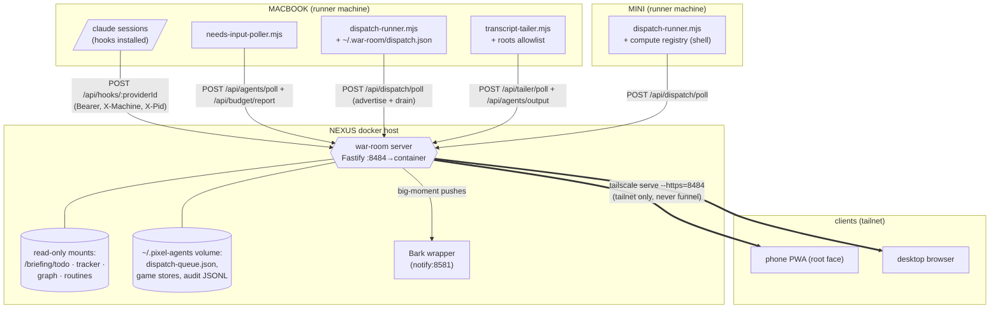

# ARCHITECTURE — the War Room system in layers

Written 2026-07-12 against `war-room/v3 @ 16d7eee` (which is ALSO the live
NEXUS deploy — verified via `GET /api/version` returning that sha, built
2026-07-12T19:14Z). Derived from code, not ledger prose; every claim below
cites the file that enforces it. For the ingest-path map (every route +
mount in table form) see `WIRING.md` at the repo root; for the mounted
data sources' freshness contracts see `docs/DATA-SOURCES.md`.

The repo is a fork of pixel-agents (upstream reference: `CLAUDE.md` at the
repo root). Everything in this doc is the fork's own v1–v4 layer on top of
that base runtime.

## 1. Topology

One docker-contained server on NEXUS is the single aggregation point.
Per-machine daemons (opt-in, launchd-installed, one instance per machine)
push telemetry in and poll instructions out; clients ride tailscale serve.
Nothing is exposed off the tailnet (the deploy runbook hard-fails if the
port ever appears in `tailscale funnel status` —
`.planning/runbooks/nexus-war-room-deploy.sh:186`).

Shapes carry the meaning (colorblind-safe): parallelogram = agent
sessions, rectangles = daemons, hexagon = the server, cylinders = data at
rest, double arrows = the client-facing HTTPS ingress.

Machine identity is a TEXT label (`X-Machine` header, sanitized to
`^[A-Z0-9_-]{1,32}$` — `server/src/httpServer.ts:1892`). The server's own
label comes from `WAR_ROOM_MACHINE` in the deploy env (`NEXUS` on the live
deploy); an event whose label differs is REMOTE and gets the hooks-only
treatment (§4).

## 2. Wire surface — every route, with auth tier

All routes register in `createHttpServer()`
(`server/src/httpServer.ts:180-208`). Three trust tiers:

- **unauth-read** — GET snapshots; no auth because the server is
  tailnet-only (same posture as `/api/health`).
- **unauth-action** — POST player actions from the webview; same
  tailnet-only rationale. Denials are `{ok:false, reason}` at 200, never
  4xx ("deny is a decision" — `server/src/dispatchStore.ts:12`).
- **Bearer** — daemon telemetry/poll routes; `Authorization: Bearer
<WAR_ROOM_TOKEN>` (timing-safe compare, `httpServer.ts:2212`), usually
  plus `X-Machine`.

| Route                                                                                                          | Tier                                  | Registered                          | Purpose                                                                                      |
| -------------------------------------------------------------------------------------------------------------- | ------------------------------------- | ----------------------------------- | -------------------------------------------------------------------------------------------- |
| GET `/api/health`                                                                                              | unauth-read                           | `httpServer.ts:446`                 | liveness                                                                                     |
| GET `/api/version`                                                                                             | unauth-read                           | `httpServer.ts:454`                 | deploy identity (GIT_SHA/BUILT_AT baked by runbook)                                          |
| GET `/api/briefing`                                                                                            | unauth-read                           | `httpServer.ts:473`                 | todo+tracker+digest fold (also reconciles contracts)                                         |
| GET `/api/graph/search?q=&depth=`                                                                              | unauth-read                           | `httpServer.ts:467`                 | knowledge-graph search over the :ro graph mount                                              |
| GET `/api/shift`                                                                                               | unauth-read                           | `httpServer.ts:487`                 | today/yesterday scorecard + opsReview fold + auto-action count                               |
| GET `/api/progression`                                                                                         | unauth-read                           | `httpServer.ts:498`                 | XP/level/streak snapshot (live twin rides WS)                                                |
| GET `/api/ops/review`                                                                                          | unauth-read                           | `httpServer.ts:503`                 | T3 rung-1 findings with receipts (TTL-cached analyze-on-demand)                              |
| GET `/api/ops/auto`                                                                                            | unauth-read                           | `httpServer.ts:508`                 | T3 rung-3 auto-executor whitelist state + receipts ledger                                    |
| GET `/api/districts`                                                                                           | unauth-read                           | `httpServer.ts:514`                 | per-project milestone state (currently honest NO DATA — see DATA-SOURCES)                    |
| GET `/api/inbox`, `/api/inbox/content`                                                                         | unauth-read                           | `httpServer.ts:523,524`             | vault routine-output tray (traversal-hardened read)                                          |
| GET `/api/wiring`                                                                                              | unauth-read                           | `httpServer.ts:547`                 | auto-detected `.planning/STATE.md` projects under WAR_ROOM_WIRING_ROOTS                      |
| POST `/api/hooks/:providerId`                                                                                  | Bearer                                | `httpServer.ts:576`                 | hook-event ingress (X-Machine tags remote, X-Pid attaches OS pid)                            |
| POST `/api/agents/poll`                                                                                        | Bearer+X-Machine                      | `httpServer.ts:657`                 | needs-input poller ingest; staleness sweep colocated                                         |
| POST `/api/agents/output`                                                                                      | Bearer+X-Machine                      | `httpServer.ts:781`                 | remote tailer's transcript-line ingest (own bodyLimit; token usage rides it)                 |
| POST `/api/tailer/poll`                                                                                        | Bearer+X-Machine                      | `httpServer.ts:871`                 | drains TailInstruction queue + advertisement reconciliation                                  |
| GET `/api/dispatch/machines`, `/recent`                                                                        | unauth-read                           | `httpServer.ts:995,1001`            | live-runner machines / last ~20 dispatches                                                   |
| POST `/api/dispatch/poll`                                                                                      | Bearer+X-Machine                      | `httpServer.ts:1007`                | runner poll: advertises capability, receives `pending` + drained `stop[]` + `answer[]`       |
| POST `/api/dispatch/:id/kill`, `/release`                                                                      | unauth-action                         | `httpServer.ts:1093,1103`           | queue stop / release HELD (budget) dispatch                                                  |
| POST `/api/dispatch/:id/decision`, `/status`, `/output`                                                        | Bearer                                | `httpServer.ts:1109,1132,1217`      | runner-reported accept/deny, lifecycle (started/exited/killed/capped), live output chunks    |
| POST `/api/agents/kill`; GET `/api/agents/kill/:id`; POST `/api/pid-kills/:id/status`                          | unauth-action / unauth-read / Bearer  | `httpServer.ts:1259,1279,1291`      | observed-session pid-kill: queue, outcome poll, runner report                                |
| POST `/api/agents/answer`; GET `/api/agents/answer/:id`, `/api/agents/answers`; POST `/api/answers/:id/status` | unauth-action / unauth-read / Bearer  | `httpServer.ts:1322,1336,1348,1363` | T2 answer plane: queue, outcome poll, receipts, runner report                                |
| `/api/employees*` (GET + 8 verbs)                                                                              | unauth-action                         | `httpServer.ts:1421-1471`           | game-face roster: train/promote/break/fire/retire/rehire/onboard/assign                      |
| `/api/economy*`, `/api/economy/perks/buy`                                                                      | unauth-action                         | `httpServer.ts:1482,1764`           | cash/rep snapshot, summary digest, vacation, perks                                           |
| `/api/building/*` (expand/room/furniture/sell)                                                                 | unauth-action                         | `httpServer.ts:1525`                | check-debit-persist-broadcast layout mutations                                               |
| `/api/chains/*`, `/api/standing-orders/*`, `/api/dispatch-templates/*`                                         | unauth-action                         | `httpServer.ts:1608,1639,1701`      | automation defs/runs; confirm-first-fire is the only route clearing that flag                |
| GET `/api/budget`; POST `/api/budget/report`, `/codex-cap`                                                     | unauth-read / Bearer / unauth-action  | `httpServer.ts:1741,1743,1754`      | rate-limit guardrail snapshot + poller ingest + codex weekly cap                             |
| POST `/api/automation/stop-all`, `/resume`                                                                     | unauth-action                         | `httpServer.ts:1786,1807`           | global kill switch: standing orders + chains + auto-executor + HELD rollover freeze          |
| `/api/contracts*`, `/api/studio-contracts*`, `/api/rework*`                                                    | unauth-action                         | `httpServer.ts:1826,1848,1870`      | v2/v3 game planes; REWORK re-enqueues through the normal dispatch gates                      |
| GET `/ws`                                                                                                      | none (standalone) / Bearer (embedded) | `httpServer.ts:1914`                | the protocol channel: store broadcasts + per-plane fan-outs + subscription-gated output tail |

WS planes (`registerWebSocketRoute`, `httpServer.ts:1909`): agent
lifecycle from `AgentStateStore`, then one pure-forwarding subscription
per game store (progression, dispatch, employees, economy, chains,
standing orders, budget), each with a connect-time replay. v3 Living
Studio planes (contracts/dossiers/match-day/rework/rivalries) are gated
per-send by `v3Flags.ts` — a plane with no real source data stays silent
rather than broadcasting fiction. The output tail is the one
SUBSCRIPTION-GATED plane: `outputChunk` goes only to sockets that sent
`tailSubscribe`, with a 1 MiB per-socket backpressure shed
(`httpServer.ts:2230`).

## 3. Dispatch containment — wire carries intent, machine carries capability

The server NEVER shells out (`dispatchStore.ts:4`). A dispatch is a queue
record; the only thing that ever spawns a process is the per-machine
runner (`bin/dispatch-runner.mjs`), and it decides against its OWN local
allowlist `~/.war-room/dispatch.json` — installed deny-everything
(`{"providers":[],"roots":[],"focus":false}`,
`.planning/runbooks/install-dispatch-runner-launchd.sh:100-107`) and
re-read every tick (vanished/corrupt file = deny everything, never falls
open). The server cannot override that decision; validation logic is pure
and unit-tested in `bin/lib/dispatch-rules.mjs`.

Layered gates on the way to a spawn:

1. **enqueue()** (`dispatchStore.ts`): closed provider enum
   (`claude|codex|gemini|shell`), prompt cap 4000 chars, closed
   effort/permission-mode enums (free text would be argv injection),
   ringing cap 5/machine, 10-min TTL sweep, T5 daily token ceiling
   (crossing it HOLDS as `queued-budget`, released by explicit
   `/release` or local-date rollover).
2. **wire minimization**: the full prompt travels ONLY on the
   Bearer-authed runner poll; the WS broadcast plane carries a 120-char
   `promptPreview` (`dispatchStore.ts:48`).
3. **runner allowlist**: provider ∈ allowlist, cwd realpath-contained
   under an allowlisted root (symlink-safe), `focus`/`sessions` opt-in
   flags. `shell` dispatches resolve an opaque `scriptId` against the
   machine-local `compute` registry — interpreter/path never travel the
   wire (T8, `MINI-COMPUTE-NODE.md`).
4. **kill containment**: `StopInstruction` has two never-conflated kinds
   (`dispatchStore.ts:179`) — `dispatch` (only honored via the runner's
   own in-memory live-children registry; no match = `not-found`, never a
   raw `process.kill`) and `pid` (only after the runner verifies via `ps`
   that the target is actually a claude process).
5. **preamble**: every LLM prompt gets a server-owned context preamble at
   enqueue time (`DISPATCH_CONTEXT_PREAMBLE` for one-shot jobs /
   `DISPATCH_SESSION_PREAMBLE` for managed sessions —
   `dispatchStore.ts:113-129`) so the dispatched agent knows what drove it.

Every transition appends to an append-only audit JSONL on BOTH ends
(server: `~/.pixel-agents/dispatch-audit.jsonl`; runner keeps its own).

## 4. Hook ingestion + the tailer plane

**Hooks** (`registerHookRoute`, `httpServer.ts:575`): Claude Code hook
scripts POST 11 event types to `/api/hooks/:providerId`. The route tags
`__machine` (from X-Machine) and `__pid` (from X-Pid — Claude runs hooks
as a direct child, so `$PPID` is the session's real OS pid), then hands
off to `server/src/hookEventHandler.ts`, which normalizes via the
provider (`server/src/providers/hook/claude/claude.ts`) and dispatches
into the runtime/`AgentStateStore`. Remote events get their
`transcript_path` retained in `remoteTranscriptPaths.ts` and then STRIPPED
(the file lives on the remote machine; watching it here would fail), so
remote adoption is hooks-only.

**Tailer plane** (T1 remote live-tail, S1–S3): demand is refcounted per
agent in `server/src/remoteTailDemand.ts` — N WS `tailSubscribe`s to the
same remote agent is one tail-on; the last unsubscribe (or socket close)
enqueues tail-off. `bin/transcript-tailer.mjs` polls
`/api/tailer/poll`, validates every transcript path against its LOCAL
roots allowlist (re-checked every read pass — TOCTOU-hardened), does
offset-tracked byte-buffered incremental reads, and POSTs assistant lines
to `/api/agents/output`. There each line is rendered through the SAME
`renderTranscriptLine` the local tap uses
(`server/src/transcriptOutputTap.ts`) into the same output ring
(`outputRingStore.ts`), and `message.usage` feeds the SAME
`applyTokenUsage` path as local transcripts — with
`isRecentEnoughForShiftSpend` guarding the `fromStart:true` full-file
replay from double-counting historical spend (`httpServer.ts:780-845`).
A restarted tailer self-heals: its next poll advertises an empty `active`
list and `reconcileAdvertisement` re-issues every still-demanded tail.

## 5. The two faces and cutover state

Face-merge (phase 6, `FACE-MERGE-PLAN.md`) put the v3 "Living Studio"
build (`webview-v3/`) at the ROOT of the standalone server, with the
legacy v1 face (`webview-ui/`) surviving at `/v1/` for one grace release
(`httpServer.ts:143-176`). Old `/v3` URLs 301 to root WITH their query
string preserved (deep links like `/v3/?agentId=5` keep working); the
redirect rebuild is path/query-separated to close an open-redirect
(`//evil.example/x`) found in the P6 codex review (`httpServer.ts:157-168`).
The root face is a PWA (manifest + immediate-activation service worker
with a `/v3` denylist); the legacy face's stale SW heals itself by
re-fetching `/sw.js` and getting v3's skipWaiting/clientsClaim worker.

`webview-v3/src/` structure: `engine/` (isometric canvas renderer,
walkers, camera, soundscape), `net/` (WS connection + one facts module
per REST plane: dispatch, answers, districts, graph, inbox, kills, tail),
`state/` (per-plane stores), `components/` (HUD strip, panel dock,
CallModal, AgentDrawer, TriageBoard, TailSheet, Briefing/Inbox/Districts/
GraphSearch/OpsReview panels, StopAllControl).

## 6. The answer plane (v4 T2 — REMOTE-ANSWER-DESIGN.md)

Lets the board answer a QUESTION from a managed remote session — with the
same containment shape as dispatch:

1. **Managed flag is server-derived, never client-asserted**: the runner's
   poll advertises its live tmux-managed sessions (manifest re-derived
   from tmux liveness every tick); `applyManagedFlags`
   (`httpServer.ts:941`) pid-correlates the advertisement against live
   agents and broadcasts `agentManagedUpdate`. That flag is the board's
   ONLY license to render the ANSWER verb; a stale advertisement sweeps
   the flag off (`dispatchStore.sweepStaleManaged`).
2. **Queue with one-shot nonce**: `POST /api/agents/answer` targets
   (machine, pid); the server resolves it against the LIVE advertisement
   (no coverage = honest `not-managed` deny) and mints a nonce per
   instruction (`dispatchStore.ts:901-946`).
3. **Drained at-most-once** on the runner's next poll (`answer[]`, same
   channel discipline as `stop[]`). Undelivered answers sweep to an
   honest `expired`, never a fake delivered.
4. **Runner-side re-check + tmux send-keys discipline**: manifest + tmux
   liveness + nonce are re-verified at delivery time; text goes in as
   literal `send-keys -l` followed by a separate Enter, with a
   verbatim-text audit line per outcome (`bin/dispatch-runner.mjs`
   header). Sessions the runner never launched are unreachable by
   construction — there is no code path to any other pty.
5. **Receipts**: `GET /api/agents/answers` returns the verbatim delivered
   text (the receipt IS the text), polled by the drawer.

## 7. Self-healing ladder + fleet controls (v4 T3/T5)

Rung 1: `opsAdvisor.ts` — read-only findings with receipts
(`/api/ops/review`, folded into `/api/shift`). Rung 3:
`autoExecutor.ts` — an interval tick (`httpServer.ts:322`) that filters
findings to a whitelist that SHIPS EMPTY (deny-by-default; enabling it is
a hand edit to the persisted file), and acts only through the same
`redispatchCrate()` a human REQUEUE tap uses. T5: per-dispatch
`timeoutSec` (runner-enforced, distinct `capped` terminal status) and the
daily fleet token ceiling (`dispatchStore.setBudgetGate`,
`httpServer.ts:252`). `POST /api/automation/stop-all` is one transaction
across standing orders, chain runs, the auto-executor, and HELD rollover
release — manual CallModal dispatch is deliberately unaffected (the kill
switch targets autonomy, not the human).
